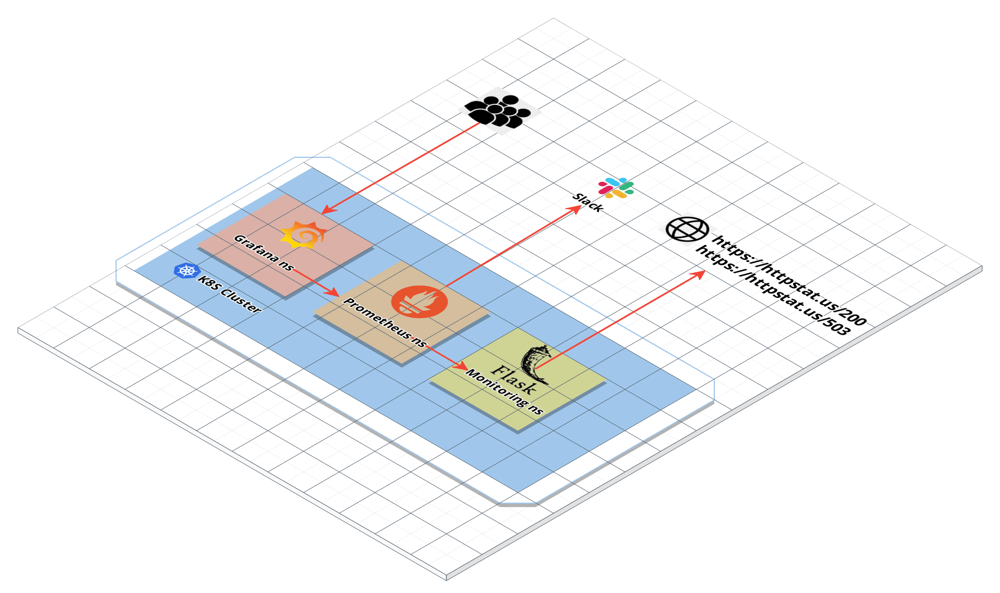

# Monitoring URLs availability and response times
A demo project to monitor URLs availability and response times using Prometheus client libraries.



The monitoring application is writting in Python using Flask framework and Prometheus Client Libraties.

## Application Development and Configuration
The Web Application is writtent in Python using Flask framework in order to monitor defined URLs avaialbility and response times by exposing the following metrics for evey URL:
| metric name | metric type | labels | Description |
| ------ | ------ | ------ |  ------ | 
| sample_external_url_up | Guage | url | value is set to 1 if response code is 200 or 0 otherwise |
| sample_external_url_response_ms | Histogram | url | response time in milliseconds |

The web application serves the following HTTP handlers:

| Handler | Descriiption |
| ------ | ------ |
| / (GET) | returns the application configuration in JSON format including the list of monitored URLs |
| /health (GET) | returns 200 when the monitored endpoints are accessible by the application (using python sockets). This handler is used to control pods readiness and livenes |
| /metrics | the actual handler exposed as a target for Prometheus server, it reaturns the python process, runtime metrics as well as the uptime and response time metrics for monitored endpoints

The list of URL can be defined through a YAML configuration file `config.yaml`. In Kubernetes deployments these configurations can be adjusted through ConfigMap or through helm release values.


## Deployment 

#### _Locally_

1) (Optional) Build a Docker image locally using the commands:
```
cd app/
docker build prom-monitoring-urls-web-app
```

Alternatively, you can utilize the public image [Aelshafei/prom-monitoring-urls-web-app](https://hub.docker.com/repository/docker/aelshafei/prom-monitoring-urls-web-app)

2) Create a configuration file `config.yaml`:
```
name: 'prom_monitoring_urls_web_app'
description: 'Prometheus metrics for URLs availability and response availiability'
urls:
  - https://httpstat.us/200
  - https://httpstat.us/503
```

3) run the container locallay using the command:
```
 docker run -p 8000:8000 -v ${PWD}/config.yaml:/app/config.yaml <aelshafei/prom-monitoring-urls-web-app>
```


#### _Kubernetes_

The Application can be deployed using the helm chart in this repository using the command:
```
cd helm/
helm install prom-monitoring-urls-web-app ./prom-monitoring-urls-web-app/ -n monitoring --set image.repository=aelshafei/prom-monitoring-urls-web-app --set "conig.urls={https://httpstat.us/200,https://httpstat.us/503}
```

## Testing
Unit and web tests are written using [pytest](https://docs.pytest.org/) library, you can execute the tests and check the test coverage using the command:
```
cd app/
# if you are using python virtualenv, make sure to activate first (ex: source ./bin/activate)
pytest --cov=prom_monitoring_urls_web_app -v
```

You can also check details about the test covergage by generating html report using the command:
```
pytest --cov=. --cov-report=html
```

Note: a sample report is added to the assets folder in this repo.

## Security
The Dockerfile is built to run the application using non-root user. This is also configured at pods level by setting the user-id for `flask` user defined in the Dockerfile.

More best-practices can be adopted while deploying the application such as:
- Implementing [network policeis](https://kubernetes.io/docs/concepts/services-networking/network-policies/) to restrict the service access from Prometheus only and other pre-defined sources
- The application can be configued to run within service mesh such as [Istio](https://istio.io/)
- More restrictions can be applied by configured [OPA Gatekeeper policies](https://kubernetes.io/blog/2019/08/06/opa-gatekeeper-policy-and-governance-for-kubernetes/)
- Ensure that new-built images are contiiously [scanned](https://docs.docker.com/develop/scan-images/) against any known Vulnerabilities

## Screenshot
You can find some screenshots for deploying,running,testing,visualizing this project in the [screenshots Readme](/assets/SCREENSHOTS.md).

